# Locked Decisions for Story ef59396a-bdcd-4b79-bd5f-cde0b787969a

## Implementation Approach
## BigQuery Physical Schema DDL — Implementation Approach

### DDL File Organization (Mirror Hive Layout)

10 SQL files under `sql/ddl/`, numbered to match the source Hive layout for easy diffing:

| File | Contents | Objects |
|---|---|---|
| `01-create-datasets.sql` | `CREATE SCHEMA IF NOT EXISTS` for staging, ods, dm (with descriptions) | 3 datasets |
| `02-staging-sqoop-mirrors.sql` | 27 Sqoop mirror tables (Datastream-replicated) | 27 tables |
| `03-staging-delta-feeds.sql` | 8 delta CDC staging tables | 8 tables |
| `04-staging-file-feeds.sql` | 10 file-feed staging tables (partitioned + clustered + expiring) | 10 tables |
| `05-ods-cleanse.sql` | 15 ODS cleanse tables | 15 tables |
| `06-ods-delta-scd2.sql` | 8 delta-merge + 3 SCD-2 history tables | 11 tables |
| `07-ods-acid.sql` | 4 former ACID tables as native BQ tables (2 with clustering) | 4 tables |
| `08-dm-tables.sql` | 9 dims + 9 facts + 5 physical aggs | 23 tables |
| `08b-dm-materialized-views.sql` | 2 materialized views (must run AFTER 08) | 2 MVs |
| `09-dm-views.sql` | 15 analyst-facing views (BQ dialect) | 15 views |
| **Total** | | **115 + 3 datasets** |

File `08b` is separated because MVs reference base tables from `08` and must be applied after them. The harness applies files in lexicographic order.

### Hive Constructs Dropped (no BQ equivalent)

Every source DDL artifact below is eliminated — BQ native tables need none of them:

| Hive Construct | Action |
|---|---|
| `EXTERNAL TABLE` | Drop — all BQ tables are native managed |
| `STORED AS PARQUET / ORC / TEXTFILE / SEQUENCEFILE / RCFILE` | Drop — BQ manages storage format |
| `LOCATION 'hdfs://...'` | Drop — no external location |
| `TBLPROPERTIES ('parquet.compression'='SNAPPY')` | Drop — BQ auto-compresses |
| `TBLPROPERTIES ('transactional'='true')` | Drop — BQ DML is always transactional |
| `ROW FORMAT SERDE / DELIMITED / WITH SERDEPROPERTIES` | Drop — parsing happens at load time, not DDL |
| `CLUSTERED BY ... INTO N BUCKETS` | Replaced by `CLUSTER BY` (no bucket count) |

### Clustering Strategy (12 Tables)

Per locked Performance Optimization + Schema bucketing translation:

| Table | Cluster Columns | Source |
|---|---|---|
| `fact_interaction` | `agent_sk, channel, client_sk, customer_ref` | Perf Opt (3 cols) + query optimization (+customer_ref) |
| `fact_agent_activity` | `agent_sk, state_code` | Perf Opt |
| `fact_queue_interval` | `queue_sk` | Perf Opt |
| `fact_csat_survey` | `program_sk, agent_sk` | Perf Opt |
| `fact_billing_line` | `client_sk, program_sk` | Perf Opt |
| `fact_adherence_daily` | `agent_sk` | Perf Opt |
| `fact_ticket` | `program_sk, assigned_agent_sk` | Perf Opt |
| `agg_agent_daily` | `agent_sk, site_code` | Perf Opt |
| `agg_queue_hourly` | `queue_sk` | Perf Opt |
| `ods_interaction` | `agent_id, client_code` | Perf Opt |
| `ods_agent_acid` | `agent_id` | Schema bucketing translation |
| `ods_ticket_acid` | `ticket_id` | Schema bucketing translation |

`ods_client_acid` and `ods_invoice_acid` — no clustering (tiny tables: 10 and 290 rows).

### TABLE OPTIONS

| Option | Tables | Value |
|---|---|---|
| `require_partition_filter = true` | `fact_interaction`, `fact_agent_activity`, `fact_queue_interval` | Prevents accidental full scans |
| `partition_expiration_days = 365` | All 10 `stg_file_*` tables | Replaces housekeeping script 86 |

### Column Descriptions (70 total)

All 68 epoch-annotation COMMENTs from source Hive DDL carried verbatim to BQ column `OPTIONS(description=...)`:
- `epoch SECONDS (legacy)` — telephony, WFM, HR, CRM columns
- `epoch MILLISECONDS (legacy)` — ticketing, file feed, CDC `change_ms` columns
- `Oracle string YYYYMMDDHH24MISS (legacy)` — CRM contract date strings

Plus 2 lie-column descriptions (per EPOCH-POLICY.md):
- `stg_fin_invoice.issued_ts_sec` → `"!! name says seconds, VALUES ARE MILLIS !!"`
- `stg_fin_invoice.due_ts_sec` → `"!! name says seconds, VALUES ARE MILLIS !!"`

### Materialized View Definitions

**`dm.mv_agent_weekly`** (replaces `agg_agent_weekly`, base: `agg_agent_daily`):

Weekly rollup grouping by ISO week boundary derived from `date_key`:

```sql
CREATE MATERIALIZED VIEW dm.mv_agent_weekly AS
SELECT
  CAST(FORMAT_DATE('%Y%m%d',
    DATE_TRUNC(PARSE_DATE('%Y%m%d', CAST(date_key AS STRING)), ISOWEEK)
  ) AS INT64)                                        AS week_start_key,
  agent_sk,
  site_code,
  COUNT(*)                                           AS days_worked,
  SUM(interactions_handled)                          AS interactions_handled,
  CAST(AVG(avg_handle_seconds) AS NUMERIC)           AS avg_handle_seconds,
  CAST(AVG(adherence_pct) AS NUMERIC)                AS adherence_pct,
  CAST(AVG(occupancy_pct) AS NUMERIC)                AS occupancy_pct
FROM dm.agg_agent_daily
GROUP BY 1, 2, 3;
```

**`dm.mv_site_daily`** (replaces `agg_site_daily`, base: `agg_agent_daily`):

Site-level rollup aggregating agent metrics. `sl_pct` requires `fact_queue_interval` — BQ MVs support joins, so the MV LEFT JOINs a queue-interval subaggregate. If BQ rejects the multi-fact join at CREATE time, fall back to computing `sl_pct` via a separate subquery or as NULL and document the limitation.

```sql
CREATE MATERIALIZED VIEW dm.mv_site_daily AS
SELECT
  a.date_key,
  a.site_code,
  COUNT(DISTINCT a.agent_sk)                         AS agents_active,
  SUM(a.interactions_handled)                        AS interactions,
  CAST(AVG(a.avg_handle_seconds) AS NUMERIC)         AS avg_handle_seconds,
  CAST(q.sl_pct AS NUMERIC)                         AS sl_pct,
  CAST(AVG(a.adherence_pct) AS NUMERIC)              AS adherence_pct
FROM dm.agg_agent_daily a
LEFT JOIN (
  SELECT qi.date_key,
         dq.site_code,
         SAFE_DIVIDE(SUM(qi.answered_in_sl), SUM(qi.answered)) * 100 AS sl_pct
  FROM dm.fact_queue_interval qi
  JOIN dm.dim_queue dq ON dq.queue_sk = qi.queue_sk
  GROUP BY qi.date_key, dq.site_code
) q ON q.date_key = a.date_key AND q.site_code = a.site_code
GROUP BY a.date_key, a.site_code, q.sl_pct;
```

### View Dialect Translation (15 Views)

All 15 views translated per locked SQL Dialect Translation rules. Key per-view translations:

| View | Translation Applied |
|---|---|
| `vw_org_hierarchy` | `WITH RECURSIVE` — BQ-native, no change needed |
| `vw_active_agents_ndv` | `NDV()` → `APPROX_COUNT_DISTINCT()` |
| `vw_csat_rollup` | `GROUP BY ... WITH ROLLUP` → `GROUP BY ROLLUP(...)`; `GROUPING__ID` → `GROUPING(client_id, program_code)` with bit-order reversal |
| `vw_call_driver_regex` | `RLIKE` → `REGEXP_CONTAINS()`; `regexp_extract(s, p, 1)` → `REGEXP_EXTRACT(s, p)` |
| `vw_repeat_contact_window` | `unix_timestamp(ts)` → `UNIX_SECONDS(ts)` |
| `vw_billing_reconciliation` | `from_unixtime(CAST(x/1000 AS BIGINT))` → `TIMESTAMP_MILLIS(x)`; `unix_timestamp()` → `UNIX_SECONDS()` |
| `vw_first_contact_resolution` | `date_add(f.end_ts, 7)` → `TIMESTAMP_ADD(f.end_ts, INTERVAL 7 DAY)` |
| `vw_shrinkage_analysis` | `from_unixtime(unix_timestamp(CAST(...),'yyyyMMdd'),'yyyy-MM-dd')` → `FORMAT_DATE('%Y-%m-%d', PARSE_DATE('%Y%m%d', CAST(f.date_key AS STRING)))` |
| `vw_queue_sla_attainment` | Layer-skip read of `staging.stg_crm_sla_target` — requires authorized view on `staging` dataset |
| `vw_billing_reconciliation` | Layer-skip read of `staging.stg_fin_invoice` — requires authorized view on `staging` dataset |
| All other views | Standard translations (window functions, CTEs, JOINs all BQ-compatible) |

### Harness Integration (Mode-2 Build-and-Verify)

The DDL files are supplied as `migration.steps` of `kind: ddl` in the MVS YAML. The harness:
1. Creates an ephemeral build dataset (or uses `isolate: true` for parallel runs)
2. Applies each DDL file in order (01→09) via `BigQuery.query()` — verbatim, no normalization
3. Reads back from `INFORMATION_SCHEMA` to verify against source ground truth (`manifests/tables.yaml` + `hive/ddl/*.hql`)
4. Tears down the ephemeral dataset

Per-object error attribution: each `CREATE` statement is a separate SQL statement within the file. The harness splits on `;` and executes individually, catching errors per-object. Any failure reports the object name + BQ error message (AC#1 HARD FAIL requirement).

## Data Mapping
## BigQuery Physical Schema DDL — Data Mapping

### Scalar Type Mapping

All non-partition data columns follow this deterministic map (per locked Schema + SQL Dialect decisions):

| Hive Type | BQ Type | Count | Notes |
|---|---|---|---|
| `BIGINT` | `INT64` | ~200 | Includes all surrogate keys, epoch columns, counters |
| `INT` | `INT64` | ~80 | BQ has no 32-bit integer |
| `SMALLINT` | `INT64` | 0 | Not present in source, but rule exists |
| `STRING` | `STRING` | ~400 | Largest group — codes, names, refs |
| `BOOLEAN` | `BOOL` | ~50 | Flags |
| `DOUBLE` | `FLOAT64` | ~4 | sentiment_score, silence_pct |
| `TIMESTAMP` | `TIMESTAMP` | ~60 | ODS/DM layers only (staging uses epoch INTs) |
| `DECIMAL(p,s)` | `NUMERIC(p,s)` | 52 | Precision/scale preserved exactly |

### DECIMAL Precision/Scale Matrix (52 columns)

| Source DECIMAL | BQ NUMERIC | Example Columns |
|---|---|---|
| `DECIMAL(14,2)` | `NUMERIC(14,2)` | total_amount, line_amount, billed_amount, net_revenue |
| `DECIMAL(12,4)` | `NUMERIC(12,4)` | unit_rate, rate, old_rate, new_rate |
| `DECIMAL(12,2)` | `NUMERIC(12,2)` | qty, min_commit, charge_amount, credit_amount, amount, telco_cost_amount, sla_credit_amount |
| `DECIMAL(10,4)` | `NUMERIC(10,4)` | target_value |
| `DECIMAL(8,2)` | `NUMERIC(8,2)` | avg_handle_seconds, avg_speed_answer_sec, avg_handle_sec, required_fte |
| `DECIMAL(7,2)` | `NUMERIC(7,2)` | volume_variance_pct |
| `DECIMAL(5,2)` | `NUMERIC(5,2)` | penalty_pct, overall_pct, adherence_pct, occupancy_pct, sl_pct, avg_csat, pct_promoters, pct_detractors |

### Complex Type Mapping (4 columns across 3 tables)

| Table | Column | Hive Type | BQ Type | Sub-fields |
|---|---|---|---|---|
| `stg_file_qa_forms` | `sections` | `ARRAY<STRUCT<section_code:STRING, max_points:INT, scored_points:INT>>` | `ARRAY<STRUCT<section_code STRING, max_points INT64, scored_points INT64>>` | 3 sub-fields |
| `stg_file_chat_transcripts` | `messages` | `ARRAY<STRUCT<sender:STRING, ts_ms:BIGINT, text:STRING>>` | `ARRAY<STRUCT<sender STRING, ts_ms INT64, text STRING>>` | 3 sub-fields |
| `stg_file_chat_transcripts` | `metadata` | `MAP<STRING,STRING>` | `JSON` | Queryable via `JSON_VALUE()` / `JSON_QUERY()` |
| `stg_file_speech_analytics` | `keywords` | `ARRAY<STRING>` | `ARRAY<STRING>` (REPEATED STRING) | Scalar array |

### Partition Column Type Promotions (STRING → DATE)

All date-like STRING partition columns promoted to DATE for BQ partition compatibility and cross-layer join consistency. Non-date partition columns (`extract_ts`, `client_code`, `site_code`, `channel`) stay as their mapped types.

| Partition Column Name | Hive Type | BQ Type | Format Semantics | Affected Tables |
|---|---|---|---|---|
| `load_date` | STRING | DATE | `YYYY-MM-DD` | 27 sqoop mirrors + stg_wfm_schedule (28 cols) |
| `feed_date` | STRING | DATE | `YYYY-MM-DD` | 10 file-feed tables |
| `snapshot_date` | STRING | DATE | `YYYY-MM-DD` | 6 ODS cleanse/rate_card tables |
| `event_date` | STRING | DATE | `YYYY-MM-DD` | 10 ODS cleanse/delta-merge tables |
| `sched_date` | STRING | DATE | `YYYY-MM-DD` | 1 ODS table (ods_schedule) |
| `call_date` | STRING | DATE | `YYYY-MM-DD` | 1 ODS table (ods_call) |
| `period_month` | STRING | DATE | `YYYY-MM` → first-of-month | 6 tables (2 ODS + 4 DM) |
| `work_month` | STRING | DATE | `YYYY-MM` → first-of-month | 1 ODS table (ods_timesheet) |
| `swap_month` | STRING | DATE | `YYYY-MM` → first-of-month | 1 ODS table (ods_shift_swap) |
| `event_month` | STRING | DATE | `YYYY-MM` → first-of-month | 1 ODS table (ods_attrition_event) |
| `extract_ts` | STRING | **STRING** (kept) | Timestamp string, not date-like | 8 delta tables |
| `client_code` | STRING | **STRING** (kept) | Categorical, not a date | 10 file-feed tables |

### Comprehensive Partition Strategy

| Table Group | Tables | Hive Partition | BQ Partition | BQ Partition Type |
|---|---|---|---|---|
| **DM facts (date_key)** | fact_interaction, fact_agent_activity, fact_queue_interval, fact_csat_survey, fact_qa_evaluation, fact_adherence_daily, fact_ticket, fact_ivr_path | `date_key INT` | `RANGE_BUCKET(date_key, GENERATE_ARRAY(20000101, 20991231, 1))` | Integer-range |
| **DM aggs (date_key)** | agg_agent_daily, agg_queue_hourly | `date_key INT` | Same integer-range | Integer-range |
| **DM aggs (period_month)** | agg_program_monthly, agg_csat_rollup_monthly, agg_billing_monthly | `period_month STRING` | `DATE_TRUNC(period_month, MONTH)` | Date (monthly) |
| **DM fact (period_month)** | fact_billing_line | `period_month STRING` | `DATE_TRUNC(period_month, MONTH)` | Date (monthly) |
| **fact_interaction extras** | fact_interaction | `channel STRING` (2nd partition) | Demoted to CLUSTER BY | — |
| **File-feed staging** | 10 stg_file_* tables | `client_code STRING, feed_date STRING` | Partition: `feed_date DATE`; Cluster: `client_code` | Date (daily) |
| **Sqoop mirrors** | 27 stg_* tables | `load_date STRING` | No BQ partition; `load_date DATE` as regular column at end | Unpartitioned |
| **Delta feeds** | 8 stg_*_delta tables | `extract_ts STRING` | No BQ partition; `extract_ts STRING` as regular column at end | Unpartitioned |
| **ODS cleanse** | 15 tables | Various STRING dates | No BQ partition; promoted to DATE columns at end | Unpartitioned |
| **ODS delta-merge** | 8 tables | Various STRING dates/months | No BQ partition; promoted to DATE columns at end | Unpartitioned |
| **ODS SCD-2** | 3 tables | `eff_from_year INT` | No BQ partition; `eff_from_year INT64` at end | Unpartitioned |
| **ODS ACID** | 4 tables | None (bucketed only) | No partition | Unpartitioned |
| **DM dims** | 9 tables | None | No partition (small tables) | Unpartitioned |
| **MV agent_weekly** | mv_agent_weekly | `week_start_key INT` | Inherits from base or integer-range | Integer-range |
| **MV site_daily** | mv_site_daily | `date_key INT` | Inherits from base or integer-range | Integer-range |

### Object Type Changes (2 intentional)

| Source Object | Source Type | Target Object | Target Type | Rationale |
|---|---|---|---|---|
| `dm.agg_site_daily` | TABLE | `dm.mv_site_daily` | MATERIALIZED VIEW | Per locked Performance Optimization — simple rollup of agg_agent_daily |
| `dm.agg_agent_weekly` | TABLE | `dm.mv_agent_weekly` | MATERIALIZED VIEW | Per locked Performance Optimization — weekly rollup of agg_agent_daily |

All other 98 tables remain TABLE. All 15 views remain VIEW. No silent type flips.

### Column Position Convention

Hive partition columns (99 total across 100 tables) move into the BQ column list **appended at the end** of the non-partition columns, preserving source ordinal position for data columns. Example:

```
-- Hive: CREATE TABLE t (a INT, b STRING) PARTITIONED BY (date_key INT)
-- BQ:   CREATE TABLE t (a INT64, b STRING, date_key INT64) PARTITION BY ...
```

### DM Star Schema (ER Diagram)

```mermaid
erDiagram
    dim_date ||--o{ fact_interaction : date_key
    dim_date ||--o{ fact_agent_activity : date_key
    dim_date ||--o{ fact_queue_interval : date_key
    dim_date ||--o{ fact_csat_survey : date_key
    dim_date ||--o{ fact_adherence_daily : date_key
    dim_date ||--o{ fact_ticket : date_key
    dim_agent ||--o{ fact_interaction : agent_sk
    dim_agent ||--o{ fact_agent_activity : agent_sk
    dim_agent ||--o{ fact_csat_survey : agent_sk
    dim_agent ||--o{ fact_adherence_daily : agent_sk
    dim_agent ||--o{ agg_agent_daily : agent_sk
    dim_client ||--o{ fact_interaction : client_sk
    dim_client ||--o{ fact_billing_line : client_sk
    dim_program ||--o{ fact_interaction : program_sk
    dim_program ||--o{ fact_csat_survey : program_sk
    dim_program ||--o{ fact_billing_line : program_sk
    dim_program ||--o{ fact_ticket : program_sk
    dim_queue ||--o{ fact_queue_interval : queue_sk
    dim_queue ||--o{ agg_queue_hourly : queue_sk
    agg_agent_daily ||--o{ mv_agent_weekly : base_table
    agg_agent_daily ||--o{ mv_site_daily : base_table

    dim_date {
        INT64 date_key PK
        STRING full_date
        INT64 day_of_week
        BOOL is_weekend
        STRING fiscal_period
    }
    dim_agent {
        INT64 agent_sk PK
        INT64 agent_id
        STRING full_name
        STRING site_code
        BOOL is_current
    }
    dim_client {
        INT64 client_sk PK
        INT64 client_id
        STRING client_code
        STRING client_name
    }
    dim_program {
        INT64 program_sk PK
        INT64 program_id
        STRING program_code
        INT64 client_id FK
    }
    dim_queue {
        INT64 queue_sk PK
        INT64 queue_id
        STRING queue_code
        INT64 program_id FK
    }
    fact_interaction {
        STRING interaction_id PK
        INT64 client_sk FK
        INT64 program_sk FK
        INT64 queue_sk FK
        INT64 agent_sk FK
        STRING customer_ref
        INT64 date_key FK
        STRING channel
    }
    fact_agent_activity {
        INT64 agent_sk FK
        STRING state_code
        INT64 state_seconds
        INT64 date_key FK
    }
    fact_queue_interval {
        INT64 queue_sk FK
        TIMESTAMP interval_start_ts
        INT64 offered
        INT64 date_key FK
    }
    fact_csat_survey {
        STRING survey_id PK
        INT64 program_sk FK
        INT64 agent_sk FK
        INT64 csat_score
        INT64 date_key FK
    }
    fact_billing_line {
        INT64 invoice_line_id PK
        INT64 client_sk FK
        INT64 program_sk FK
        NUMERIC line_amount "precision 14,2"
        DATE period_month
    }
    fact_adherence_daily {
        INT64 agent_sk FK
        NUMERIC adherence_pct "precision 5,2"
        INT64 date_key FK
    }
    fact_ticket {
        INT64 ticket_id PK
        INT64 program_sk FK
        INT64 assigned_agent_sk FK
        INT64 date_key FK
    }
    agg_agent_daily {
        INT64 agent_sk FK
        STRING site_code
        INT64 interactions_handled
        INT64 date_key FK
    }
    agg_queue_hourly {
        INT64 queue_sk FK
        INT64 hour_of_day
        INT64 date_key FK
    }
    mv_agent_weekly {
        INT64 week_start_key
        INT64 agent_sk
        STRING site_code
        INT64 days_worked
    }
    mv_site_daily {
        STRING site_code
        INT64 agents_active
        INT64 date_key
    }
```



### FK Type Consistency (56 join paths)

All 56 documented FK relationships in `manifests/tables.yaml` produce type-consistent BQ columns because:
- All surrogate keys (`*_sk BIGINT`) → `INT64` on both sides
- All natural keys (`*_id BIGINT`) → `INT64` on both sides
- All `period_month`/`work_month` → `DATE` on both sides (per consistent promotion)
- Self-FK: `ods_org_unit.parent_unit_id INT64` ↔ `ods_org_unit.org_unit_id INT64`

No cross-type joins exist in the target schema.

## Validation
## BigQuery Physical Schema DDL — Validation Strategy

### Validation Architecture

All 9 ACs require **live BQ catalog verification** — no offline parsing, DDL-vs-DDL comparison, or dry-run counts as a pass. The validation uses the project's Mode-2 build-and-verify harness:

1. **Apply**: Harness executes all 10 DDL files (01→09) against an ephemeral BQ dataset
2. **Verify**: Harness reads back from `INFORMATION_SCHEMA` and compares against source ground truth
3. **Teardown**: Ephemeral dataset destroyed regardless of pass/fail

Source ground truth comes from two authoritative files:
- `manifests/tables.yaml` — column names, types, tags (pk, fk, epoch annotations), partition columns, row counts
- `hive/ddl/*.hql` — COMMENTs, TBLPROPERTIES, partition/bucketing declarations

### AC-to-Pattern Mapping

| AC | What It Verifies | Harness Pattern | Data Source |
|---|---|---|---|
| **AC1** — 0 CREATE errors | All 115 DDL objects apply cleanly | `ddl_apply` — execute each CREATE individually, catch per-object errors | DDL files (01-09) |
| **AC2** — 916 columns match | Column name, type, ordinal, precision, nullability, description | `schema_conformance` — read `INFORMATION_SCHEMA.COLUMNS` + `COLUMN_FIELD_PATHS` | tables.yaml + hive/ddl COMMENTs |
| **AC3** — Object types correct | 98 TABLE + 2 MV + 15 VIEW | `object_type_check` — read `INFORMATION_SCHEMA.TABLES` | tables.yaml |
| **AC4** — Partition/cluster/options | Partition keys, cluster columns, filter requirements, expiration | `partition_conformance` — read `TABLE_OPTIONS` | Performance Opt + Schema decisions |
| **AC5** — FK type consistency | 56 FK→PK pairs same BQ type | `fk_consistency` — cross-join column types from `INFORMATION_SCHEMA.COLUMNS` | tables.yaml fk= annotations |
| **AC6** — SELECT * succeeds | 115 objects queryable + 3 tier queries | `queryability` — `SELECT * LIMIT 0` on each object + parameterized tier queries | DDL objects |
| **AC7** — Catalog read-back | Every object present in catalog | `catalog_presence` — `INFORMATION_SCHEMA.TABLES` + `INFORMATION_SCHEMA.VIEWS` | DDL objects |
| **AC8** — Live execution proof | All checks against live catalog | Meta-constraint: harness runs against real BQ, not parsed DDL | — |
| **AC9** — Scan reduction | Cluster-filtered < unfiltered | `perf_scan` — BQ job statistics comparison with loaded fixture data | datagen/ fixtures |

### Per-AC Verification Details

**AC1 — DDL Application (0 errors)**
- Each file split on `;` into individual statements
- Each statement executed via `BigQuery.query()`
- On failure: report object name (extracted from `CREATE TABLE/VIEW/MATERIALIZED VIEW <name>`) + BQ error message
- Pass: 115/115 CREATE + 3 CREATE SCHEMA = 118/118 statements succeed

**AC2 — Column Verification (916 columns)**
- For each of 100 data objects: query `INFORMATION_SCHEMA.COLUMNS WHERE table_name = '<table>'`
- Compare each column's: `column_name`, `ordinal_position`, `data_type`, `is_nullable`, `column_description`
- For DECIMAL/NUMERIC: verify `numeric_precision` and `numeric_scale` match source `DECIMAL(p,s)`
- For complex types: query `INFORMATION_SCHEMA.COLUMN_FIELD_PATHS` to verify nested sub-field names, types, and depth
- For the 2 lie columns: verify `column_description` contains the warning text
- Partition columns verified at ordinal positions after all data columns (appended at end)
- Pass: 916/916 columns match on all attributes

**AC3 — Object Type Verification**
- Query `INFORMATION_SCHEMA.TABLES` for all objects
- Assert 98 objects have `table_type = 'BASE TABLE'`
- Assert 2 objects (`mv_site_daily`, `mv_agent_weekly`) have `table_type = 'MATERIALIZED VIEW'`
- Query `INFORMATION_SCHEMA.VIEWS` for 15 view objects — confirm presence
- Any mismatch names the object and its actual vs expected type

**AC4 — Partition/Cluster/Options**
- For each partitioned table: read `INFORMATION_SCHEMA.TABLE_OPTIONS` for partition config
- For each of 12 clustered tables: read clustering_columns from catalog, compare against the exact column list matrix
- For 3 tables: verify `require_partition_filter = true`
- For 10 file-feed tables: verify `partition_expiration_days = 365`
- For 4 ACID tables: confirm no transactional TBLPROPERTIES (BQ tables never have them — absence is the assertion)

**AC5 — FK Type Consistency (56 paths)**
- Parse all `fk=<entity>` annotations from tables.yaml
- For each FK column: read its BQ type from `INFORMATION_SCHEMA.COLUMNS`
- For each referenced PK column: read its BQ type from `INFORMATION_SCHEMA.COLUMNS`
- Assert FK type = PK type (both INT64 for all surrogate/natural keys)
- Cross-dataset paths verified explicitly (staging→ods, staging→dm, ods→dm)

**AC6 — Queryability**
- Execute `SELECT * FROM <dataset>.<object> LIMIT 0` on all 115 objects (98 tables + 2 MVs + 15 views)
- Execute 3 tier-specific join queries (staging, ODS, DM) with `LIMIT 1`
- Any query error names the object and BQ's error

**AC7 — Catalog Completeness**
- Query `INFORMATION_SCHEMA.TABLES` in each of 3 datasets
- Assert every expected object name is present
- An object that EXISTS but fails `SELECT *` is still a HARD FAIL (AC6 catches this)

**AC9 — Scan Reduction (requires fixture data)**
- Prerequisite: load synthetic data from `datagen/` fixtures into the 10 hot-path clustered tables
- For each table: run a cluster-filtered query and an unfiltered query
- Compare `total_bytes_processed` from BQ job statistics
- Assert filtered < unfiltered for all 10 tables
- For 3 `require_partition_filter` tables: confirm unfiltered query is rejected by BQ

### Edge Cases and HARD FAIL Conditions

| Condition | HARD FAIL? | Action |
|---|---|---|
| CREATE statement fails | Yes | Report object name + BQ error |
| Column missing or extra | Yes | Report table + column name |
| Column type mismatch | Yes | Report table + column + expected vs actual type |
| DECIMAL precision/scale mismatch | Yes | Report column + expected vs actual p/s |
| Complex type sub-field mismatch | Yes | Report table + column + sub-field path |
| Missing column description | Yes | Report table + column (for the 70 required descriptions) |
| Object type flip (TABLE↔VIEW) | Yes | Report object + expected vs actual type |
| Partition/cluster mismatch | Yes | Report table + expected vs actual config |
| FK type inconsistency | Yes | Report FK column, PK column, both types |
| SELECT * fails | Yes | Report object + BQ error |
| Catalog read-back absent | Yes | Report object name |
| Two empty sides treated as match | Yes | Absence of an expected object is never a pass |

### Test Execution Order

1. **DDL application** (AC1) — must succeed before any other check
2. **Catalog completeness** (AC7) — confirm all objects exist
3. **Object type verification** (AC3) — confirm TABLE vs VIEW vs MV
4. **Column verification** (AC2) — detailed schema comparison
5. **Partition/cluster verification** (AC4) — structural configuration
6. **FK consistency** (AC5) — cross-table type alignment
7. **Queryability** (AC6) — functional smoke tests
8. **Scan reduction** (AC9) — performance validation (requires fixture data load step)

Steps 2-7 can run in parallel after step 1. Step 8 runs last because it requires data loading.
