# Data Mapping

## BigQuery Physical Schema DDL — Data Mapping

### Scalar Type Mapping

All non-partition data columns follow this deterministic map (per locked Schema + SQL Dialect decisions):

| Hive Type | BQ Type | Count | Notes |
|---|---|---|---|
| `BIGINT` | `INT64` | ~200 | Includes all surrogate keys, epoch columns, counters |
| `INT` | `INT64` | ~80 | BQ has no 32-bit integer |
| `SMALLINT` | `INT64` | 0 | Not present in source, but rule exists |
| `STRING` | `STRING` | ~400 | Largest group — codes, names, refs |
| `BOOLEAN` | `BOOL` | ~50 | Flags |
| `DOUBLE` | `FLOAT64` | ~4 | sentiment_score, silence_pct |
| `TIMESTAMP` | `TIMESTAMP` | ~60 | ODS/DM layers only (staging uses epoch INTs) |
| `DECIMAL(p,s)` | `NUMERIC(p,s)` | 52 | Precision/scale preserved exactly |

### DECIMAL Precision/Scale Matrix (52 columns)

| Source DECIMAL | BQ NUMERIC | Example Columns |
|---|---|---|
| `DECIMAL(14,2)` | `NUMERIC(14,2)` | total_amount, line_amount, billed_amount, net_revenue |
| `DECIMAL(12,4)` | `NUMERIC(12,4)` | unit_rate, rate, old_rate, new_rate |
| `DECIMAL(12,2)` | `NUMERIC(12,2)` | qty, min_commit, charge_amount, credit_amount, amount, telco_cost_amount, sla_credit_amount |
| `DECIMAL(10,4)` | `NUMERIC(10,4)` | target_value |
| `DECIMAL(8,2)` | `NUMERIC(8,2)` | avg_handle_seconds, avg_speed_answer_sec, avg_handle_sec, required_fte |
| `DECIMAL(7,2)` | `NUMERIC(7,2)` | volume_variance_pct |
| `DECIMAL(5,2)` | `NUMERIC(5,2)` | penalty_pct, overall_pct, adherence_pct, occupancy_pct, sl_pct, avg_csat, pct_promoters, pct_detractors |

### Complex Type Mapping (4 columns across 3 tables)

| Table | Column | Hive Type | BQ Type | Sub-fields |
|---|---|---|---|---|
| `stg_file_qa_forms` | `sections` | `ARRAY<STRUCT<section_code:STRING, max_points:INT, scored_points:INT>>` | `ARRAY<STRUCT<section_code STRING, max_points INT64, scored_points INT64>>` | 3 sub-fields |
| `stg_file_chat_transcripts` | `messages` | `ARRAY<STRUCT<sender:STRING, ts_ms:BIGINT, text:STRING>>` | `ARRAY<STRUCT<sender STRING, ts_ms INT64, text STRING>>` | 3 sub-fields |
| `stg_file_chat_transcripts` | `metadata` | `MAP<STRING,STRING>` | `JSON` | Queryable via `JSON_VALUE()` / `JSON_QUERY()` |
| `stg_file_speech_analytics` | `keywords` | `ARRAY<STRING>` | `ARRAY<STRING>` (REPEATED STRING) | Scalar array |

### Partition Column Type Promotions (STRING → DATE)

All date-like STRING partition columns promoted to DATE for BQ partition compatibility and cross-layer join consistency. Non-date partition columns (`extract_ts`, `client_code`, `site_code`, `channel`) stay as their mapped types.

| Partition Column Name | Hive Type | BQ Type | Format Semantics | Affected Tables |
|---|---|---|---|---|
| `load_date` | STRING | DATE | `YYYY-MM-DD` | 27 sqoop mirrors + stg_wfm_schedule (28 cols) |
| `feed_date` | STRING | DATE | `YYYY-MM-DD` | 10 file-feed tables |
| `snapshot_date` | STRING | DATE | `YYYY-MM-DD` | 6 ODS cleanse/rate_card tables |
| `event_date` | STRING | DATE | `YYYY-MM-DD` | 10 ODS cleanse/delta-merge tables |
| `sched_date` | STRING | DATE | `YYYY-MM-DD` | 1 ODS table (ods_schedule) |
| `call_date` | STRING | DATE | `YYYY-MM-DD` | 1 ODS table (ods_call) |
| `period_month` | STRING | DATE | `YYYY-MM` → first-of-month | 6 tables (2 ODS + 4 DM) |
| `work_month` | STRING | DATE | `YYYY-MM` → first-of-month | 1 ODS table (ods_timesheet) |
| `swap_month` | STRING | DATE | `YYYY-MM` → first-of-month | 1 ODS table (ods_shift_swap) |
| `event_month` | STRING | DATE | `YYYY-MM` → first-of-month | 1 ODS table (ods_attrition_event) |
| `extract_ts` | STRING | **STRING** (kept) | Timestamp string, not date-like | 8 delta tables |
| `client_code` | STRING | **STRING** (kept) | Categorical, not a date | 10 file-feed tables |

### Comprehensive Partition Strategy

| Table Group | Tables | Hive Partition | BQ Partition | BQ Partition Type |
|---|---|---|---|---|
| **DM facts (date_key)** | fact_interaction, fact_agent_activity, fact_queue_interval, fact_csat_survey, fact_qa_evaluation, fact_adherence_daily, fact_ticket, fact_ivr_path | `date_key INT` | `RANGE_BUCKET(date_key, GENERATE_ARRAY(20000101, 20991231, 1))` | Integer-range |
| **DM aggs (date_key)** | agg_agent_daily, agg_queue_hourly | `date_key INT` | Same integer-range | Integer-range |
| **DM aggs (period_month)** | agg_program_monthly, agg_csat_rollup_monthly, agg_billing_monthly | `period_month STRING` | `DATE_TRUNC(period_month, MONTH)` | Date (monthly) |
| **DM fact (period_month)** | fact_billing_line | `period_month STRING` | `DATE_TRUNC(period_month, MONTH)` | Date (monthly) |
| **fact_interaction extras** | fact_interaction | `channel STRING` (2nd partition) | Demoted to CLUSTER BY | — |
| **File-feed staging** | 10 stg_file_* tables | `client_code STRING, feed_date STRING` | Partition: `feed_date DATE`; Cluster: `client_code` | Date (daily) |
| **Sqoop mirrors** | 27 stg_* tables | `load_date STRING` | No BQ partition; `load_date DATE` as regular column at end | Unpartitioned |
| **Delta feeds** | 8 stg_*_delta tables | `extract_ts STRING` | No BQ partition; `extract_ts STRING` as regular column at end | Unpartitioned |
| **ODS cleanse** | 15 tables | Various STRING dates | No BQ partition; promoted to DATE columns at end | Unpartitioned |
| **ODS delta-merge** | 8 tables | Various STRING dates/months | No BQ partition; promoted to DATE columns at end | Unpartitioned |
| **ODS SCD-2** | 3 tables | `eff_from_year INT` | No BQ partition; `eff_from_year INT64` at end | Unpartitioned |
| **ODS ACID** | 4 tables | None (bucketed only) | No partition | Unpartitioned |
| **DM dims** | 9 tables | None | No partition (small tables) | Unpartitioned |
| **MV agent_weekly** | mv_agent_weekly | `week_start_key INT` | Inherits from base or integer-range | Integer-range |
| **MV site_daily** | mv_site_daily | `date_key INT` | Inherits from base or integer-range | Integer-range |

### Object Type Changes (2 intentional)

| Source Object | Source Type | Target Object | Target Type | Rationale |
|---|---|---|---|---|
| `dm.agg_site_daily` | TABLE | `dm.mv_site_daily` | MATERIALIZED VIEW | Per locked Performance Optimization — simple rollup of agg_agent_daily |
| `dm.agg_agent_weekly` | TABLE | `dm.mv_agent_weekly` | MATERIALIZED VIEW | Per locked Performance Optimization — weekly rollup of agg_agent_daily |

All other 98 tables remain TABLE. All 15 views remain VIEW. No silent type flips.

### Column Position Convention

Hive partition columns (99 total across 100 tables) move into the BQ column list **appended at the end** of the non-partition columns, preserving source ordinal position for data columns. Example:

```
-- Hive: CREATE TABLE t (a INT, b STRING) PARTITIONED BY (date_key INT)
-- BQ:   CREATE TABLE t (a INT64, b STRING, date_key INT64) PARTITION BY ...
```

### DM Star Schema (ER Diagram)

```mermaid
erDiagram
    dim_date ||--o{ fact_interaction : date_key
    dim_date ||--o{ fact_agent_activity : date_key
    dim_date ||--o{ fact_queue_interval : date_key
    dim_date ||--o{ fact_csat_survey : date_key
    dim_date ||--o{ fact_adherence_daily : date_key
    dim_date ||--o{ fact_ticket : date_key
    dim_agent ||--o{ fact_interaction : agent_sk
    dim_agent ||--o{ fact_agent_activity : agent_sk
    dim_agent ||--o{ fact_csat_survey : agent_sk
    dim_agent ||--o{ fact_adherence_daily : agent_sk
    dim_agent ||--o{ agg_agent_daily : agent_sk
    dim_client ||--o{ fact_interaction : client_sk
    dim_client ||--o{ fact_billing_line : client_sk
    dim_program ||--o{ fact_interaction : program_sk
    dim_program ||--o{ fact_csat_survey : program_sk
    dim_program ||--o{ fact_billing_line : program_sk
    dim_program ||--o{ fact_ticket : program_sk
    dim_queue ||--o{ fact_queue_interval : queue_sk
    dim_queue ||--o{ agg_queue_hourly : queue_sk
    agg_agent_daily ||--o{ mv_agent_weekly : base_table
    agg_agent_daily ||--o{ mv_site_daily : base_table

    dim_date {
        INT64 date_key PK
        STRING full_date
        INT64 day_of_week
        BOOL is_weekend
        STRING fiscal_period
    }
    dim_agent {
        INT64 agent_sk PK
        INT64 agent_id
        STRING full_name
        STRING site_code
        BOOL is_current
    }
    dim_client {
        INT64 client_sk PK
        INT64 client_id
        STRING client_code
        STRING client_name
    }
    dim_program {
        INT64 program_sk PK
        INT64 program_id
        STRING program_code
        INT64 client_id FK
    }
    dim_queue {
        INT64 queue_sk PK
        INT64 queue_id
        STRING queue_code
        INT64 program_id FK
    }
    fact_interaction {
        STRING interaction_id PK
        INT64 client_sk FK
        INT64 program_sk FK
        INT64 queue_sk FK
        INT64 agent_sk FK
        STRING customer_ref
        INT64 date_key FK
        STRING channel
    }
    fact_agent_activity {
        INT64 agent_sk FK
        STRING state_code
        INT64 state_seconds
        INT64 date_key FK
    }
    fact_queue_interval {
        INT64 queue_sk FK
        TIMESTAMP interval_start_ts
        INT64 offered
        INT64 date_key FK
    }
    fact_csat_survey {
        STRING survey_id PK
        INT64 program_sk FK
        INT64 agent_sk FK
        INT64 csat_score
        INT64 date_key FK
    }
    fact_billing_line {
        INT64 invoice_line_id PK
        INT64 client_sk FK
        INT64 program_sk FK
        NUMERIC line_amount "precision 14,2"
        DATE period_month
    }
    fact_adherence_daily {
        INT64 agent_sk FK
        NUMERIC adherence_pct "precision 5,2"
        INT64 date_key FK
    }
    fact_ticket {
        INT64 ticket_id PK
        INT64 program_sk FK
        INT64 assigned_agent_sk FK
        INT64 date_key FK
    }
    agg_agent_daily {
        INT64 agent_sk FK
        STRING site_code
        INT64 interactions_handled
        INT64 date_key FK
    }
    agg_queue_hourly {
        INT64 queue_sk FK
        INT64 hour_of_day
        INT64 date_key FK
    }
    mv_agent_weekly {
        INT64 week_start_key
        INT64 agent_sk
        STRING site_code
        INT64 days_worked
    }
    mv_site_daily {
        STRING site_code
        INT64 agents_active
        INT64 date_key
    }
```



### FK Type Consistency (56 join paths)

All 56 documented FK relationships in `manifests/tables.yaml` produce type-consistent BQ columns because:
- All surrogate keys (`*_sk BIGINT`) → `INT64` on both sides
- All natural keys (`*_id BIGINT`) → `INT64` on both sides
- All `period_month`/`work_month` → `DATE` on both sides (per consistent promotion)
- Self-FK: `ods_org_unit.parent_unit_id INT64` ↔ `ods_org_unit.org_unit_id INT64`

No cross-type joins exist in the target schema.
